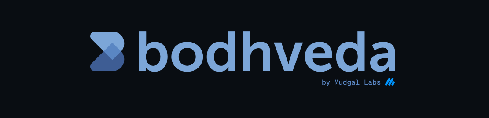

  

### Open source notifications for developers

[Discord](https://discord.gg/Wg9ebJSAAG) | [Website](https://bodhveda.com) | [Docs](https://docs.bodhveda.com) | [API References](https://docs.bodhveda.com/api-reference)

# Bodhveda

[Bodhveda](https://bodhveda.com) is an open-source notification platform for sending direct or broadcast notifications at scale, while respecting each user’s preferences. Whether you’re launching your first product or scaling to millions, Bodhveda handles delivery, preferences, and analytics so you can **focus on what matters**.

### What can you build with Bodhveda?

-   **A dev.to style blog platform** - Notify users about mentions, comments, or likes.
-   **A SaaS dashboard** - Send usage, billing, or system notifications.
-   **A large scale platform** - Deliver GitHub, YouTube, Instagram-style notifications.

... and pretty much everything.

### Features

-   **Direct & Broadcast Notifications** - Send directly to a recipient or broadcast to hundreds of thousands in seconds.

-   **Channel / Topic / Event Targeting** - Target recipients, respect preferences, and get analytics.

-   **Recipient Preferences** - Let recipients opt in/out of notifications.

-   **Inbox-like API** - Fetch notifications, update opened & read status, delete, just like a modern inbox.

-   **Headless by Design** - Send any data you want and control exactly how it’s displayed in your product.

-   **Simplicity First** - No unwanted complex workflows. Just the APIs you need to send and manage notifications.

-   **Analytics & Observability** - See who received, saw, and opened every notification.

-   **Bodhveda Console** - Your all-in-one dashboard to manage recipients, preferences, and API keys; send broadcasts or direct notifications; and monitor detailed logs, analytics, and delivery stats in real time.

-   **It's just REST** - Integrate our API with any stack. SDKs coming soon.

-   **Self-hostable or Managed** - Use our cloud or run on your own infra.

## License

[AGPL v3](LICENSE) because notifications should be free to own, run, and customize.

  
   
  Built by
   
  <a href="https://ceoshikhar.com" target="_blank"><b>ceoshikhar.com</b></a>
   
  <i>I build things. Sometimes they're good.</i>

